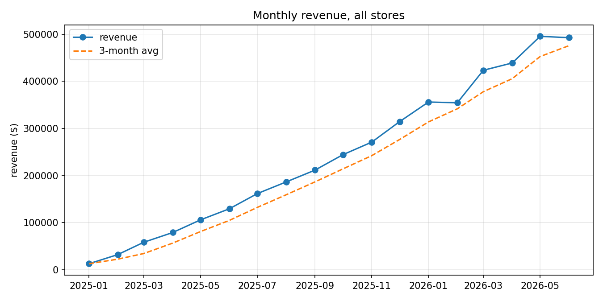
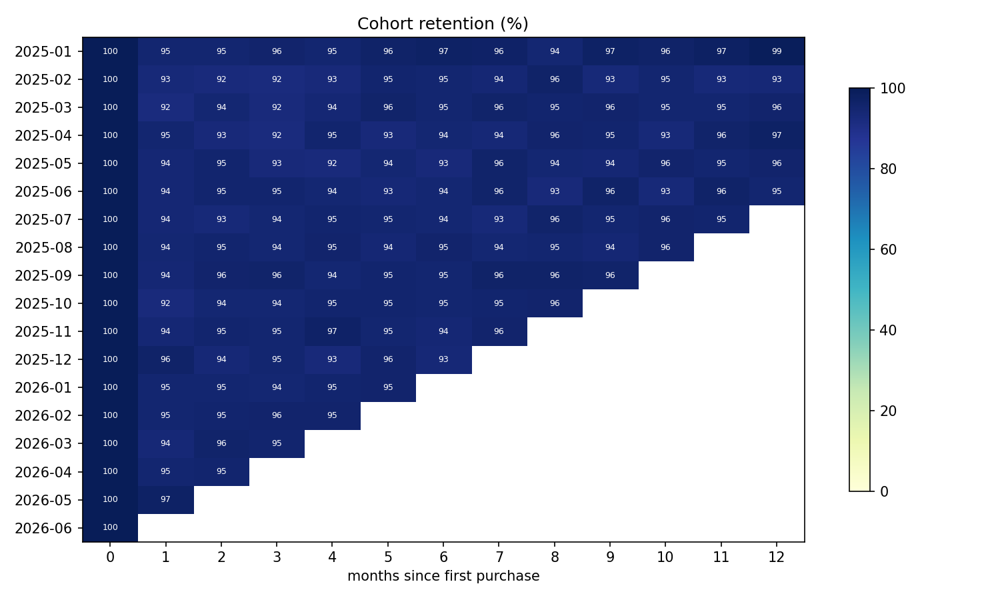
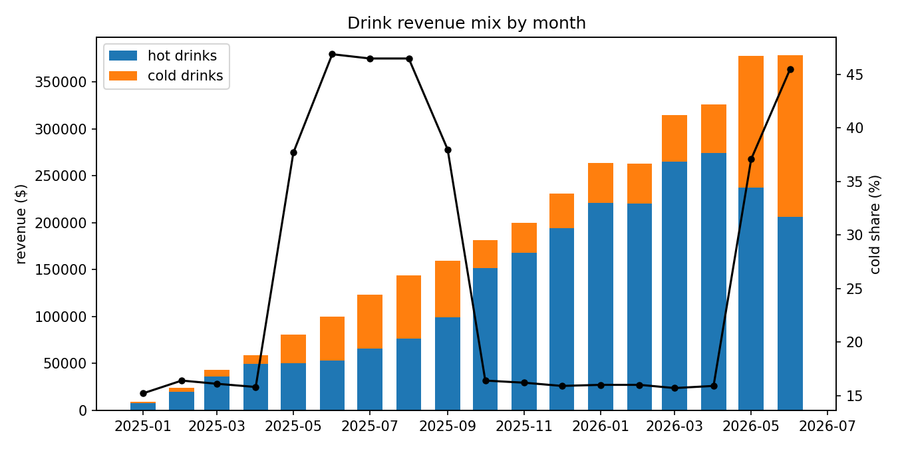

# Coffee Shop Analytics

SQL analysis project covering 18 months of transactions for a 3-store coffee chain. 622k transactions, 833k line items, 9k customers. Ten business questions, each answered in its own query file, plus a Power BI dashboard layer on top.

## About the data

The data is synthetic. I generate it with `src/generate_data.py` (fixed seed, fully reproducible). I went this route for two reasons. First, public retail datasets at true line-item grain basically don't exist, and I work with shipment-level transaction data daily, so I wanted a project at the same grain rather than pre-aggregated summaries. Second, generating the data means known patterns are planted in it — a morning commuter rush, a summer cold-drink season, a loyalty program launch in Aug 2025, a 4% espresso price increase in Jan 2026 — and the SQL either finds them or it doesn't. It's a built-in answer key.

Tables: `stores`, `products`, `customers`, `transactions`, `order_items`.

## The ten questions

| # | Business question | SQL used |
|---|---|---|
| 01 | How is revenue trending? | LAG, moving-average window frames |
| 02 | When does revenue happen during the day? | CASE bucketing, share-of-total windows |
| 03 | How do the stores compare? | YoY via LAG(12), partitioned by store |
| 04 | Which products drive profit, not just revenue? | Margin calc, RANK per category |
| 05 | How big is the hot/cold seasonal swing? | Conditional aggregation with FILTER |
| 06 | Do customers come back? | Cohort retention |
| 07 | Which customers matter most? | RFM with NTILE quintiles |
| 08 | What sells together? | Self-join basket analysis, lift |
| 09 | Did the loyalty program change behavior? | Before/after windows per member |
| 10 | Did the price increase hurt volume? | Comparison-group framing |

`src/run_analysis.py` runs everything against DuckDB and writes outputs to `results/`.

## Findings

**Growth is coming from traffic, not basket size.** Revenue roughly tripled over the period while AOV sat flat around $7. More visits, same order.



**24% of customers generate 46.5% of revenue.** That's the "champions" RFM segment — 2,152 recent, frequent, high-spend customers. The more actionable group is the 528 "at risk regulars": previously frequent customers who've gone quiet, averaging ~$920 in lifetime spend. That's the winback list.

**Espresso drinks and almond croissants sell together at 3x the expected rate** (lift ≈ 3.0). Butter croissants attach to lattes at 14% confidence. Useful for bundling and register placement.

**Retention holds above 90% by month 3 for recent cohorts.** Part of that is mix — later cohorts have more loyalty members in them — which is worth keeping in mind before crediting anything else.



**Cold drinks go from ~14% of drink revenue in winter to ~29% in summer.**



**On the loyalty program, I'm deliberately not claiming causality.** Members average 22.9 orders per 90 days before joining and 32.1 after. Tempting headline, but the comparison is contaminated: the business was growing anyway, and people who join loyalty programs self-select. A defensible answer needs a holdout group or matched comparison — the methods in my [experimentation-toolkit](https://github.com/spatiha/experimentation-toolkit) repo.

**The 4% espresso price increase didn't dent volume.** Espresso units kept growing after the January change, in line with categories that didn't get a price change.

## Dashboard

The `results/` exports feed a Power BI report — see `DASHBOARD.md` for the data model, DAX measures, and page layouts. Tableau Public link coming once published.

## Running it

```bash
pip install -r requirements.txt
python src/generate_data.py    # ~2 min, writes data/ (43 MB)
python src/run_analysis.py
```

Stack: DuckDB, Python, matplotlib, Power BI.
